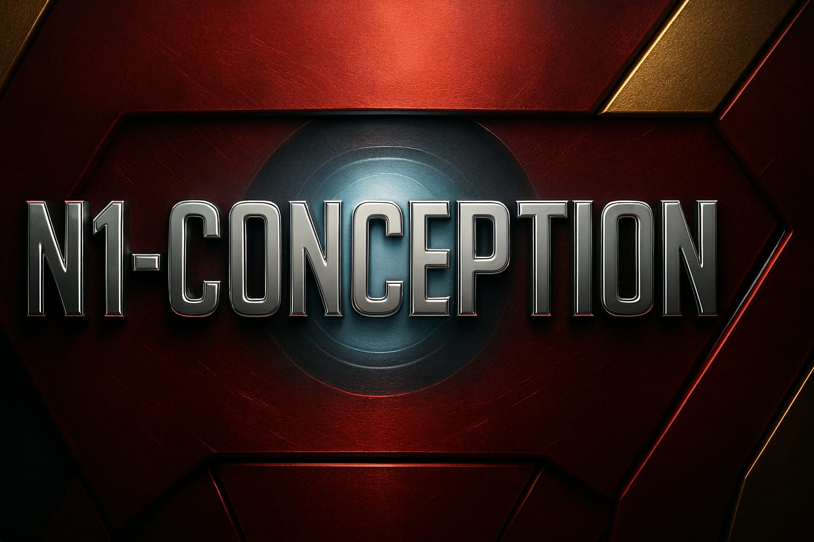
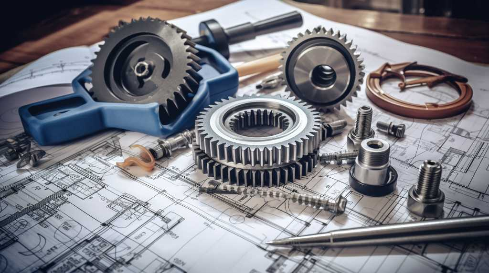
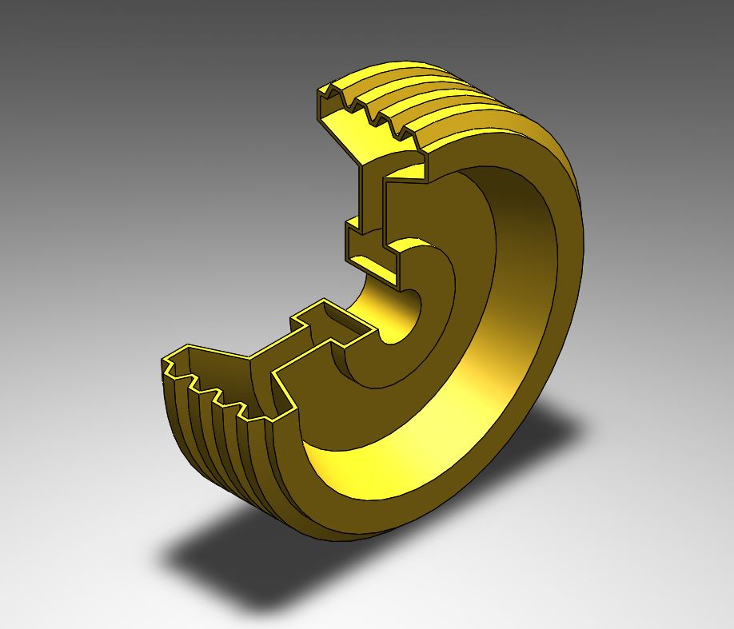
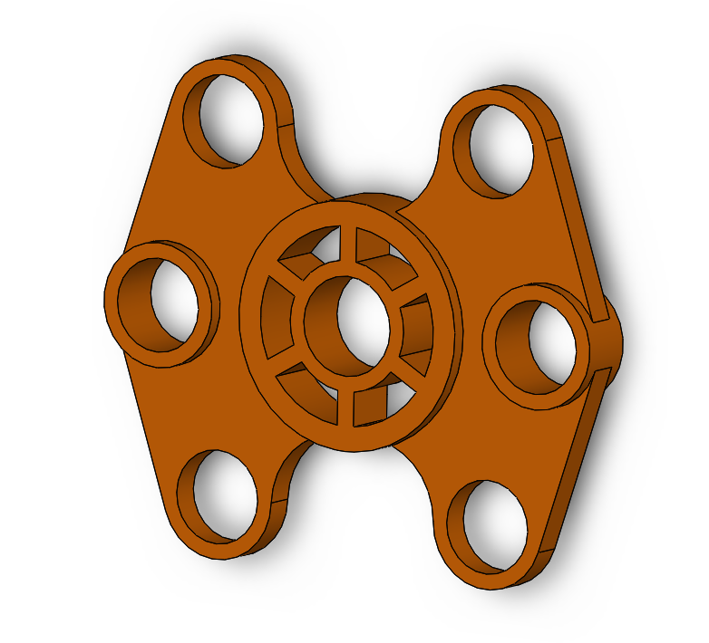
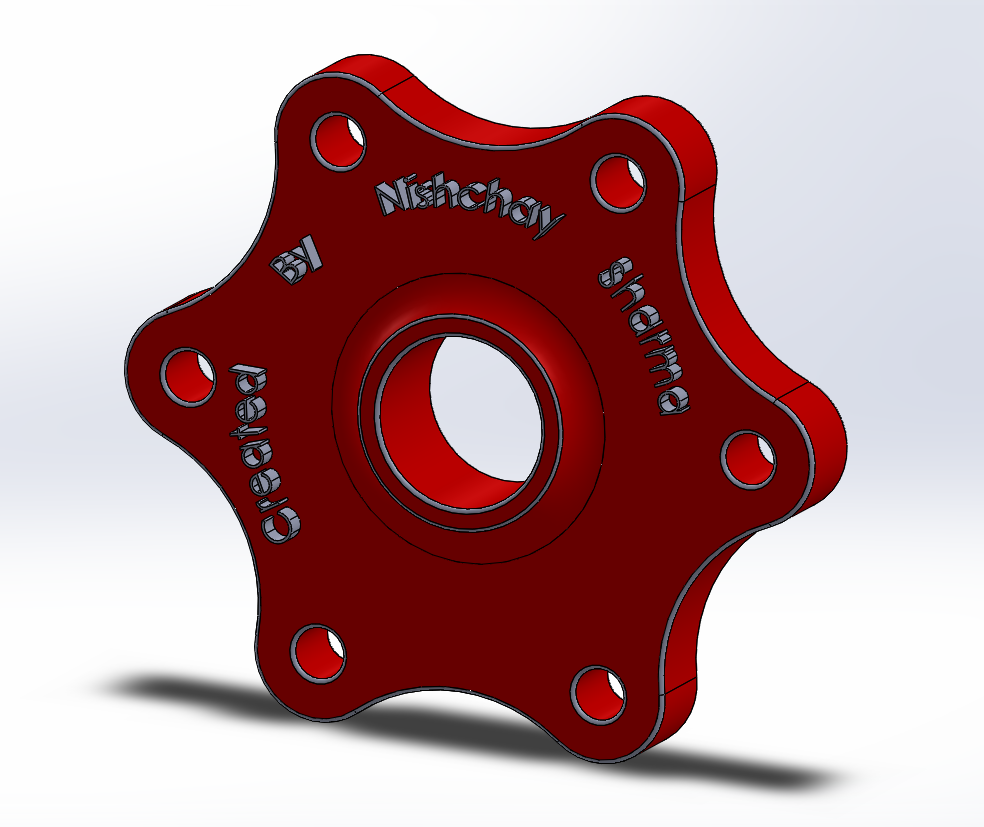

# 🚀 N1-Conception: SolidWorks Design Portfolio

*Welcome to N1-Conception – where engineering meets imagination!*  
Dive into a curated collection of mechanical marvels, meticulously modeled and brought to life using SolidWorks.

---

## 👨‍💻 About Me

I'm *Nishchay Sharma*, a passionate Mechanical Engineer and Gold Medalist who transforms ideas into tangible designs. From intricate mechanisms to futuristic concepts, I blend precision with creativity to craft models that resonate.

> "If you can imagine it, I can model it."  

---

## 🌟 Highlights

Here are a few of my standout designs—click to explore the folder and dive in:

- *Spur Gear Mechanism*
  
  A high‑precision gear train optimized for minimal backlash and smooth torque transmission.

- *Omni Mount Bracket* 
   
  A robust multi‑component model for Automobile Industry .

- *Starcore coupling* 
   
  Plys up Central hub geometry for Sci-fi twist.

---

## 💡 Skills & Tools

- *CAD Modeling* – Parts, Assemblies, Exploded Views  
- *Design for Manufacturing* – Tolerances, Material Selection  
- *Creative Engineering* – Functional meets futuristic  
- *Software Proficiency* – SolidWorks, AutoCAD 

---

## 📂 How to Explore

1. Click any project folder above.
2. Each folder includes:
   - SolidWorks files (.SLDPRT, .SLDASM)
   - High-quality renders
   - Brief model notes (if applicable)

---

## 🤝 Let's Connect

Want to collaborate or share thoughts?

- [LinkedIn](https://www.linkedin.com/in/nishchay-sharma-b354a1221?utm_source=share&utm_campaign=share_via&utm_content=profile&utm_medium=android_app)  
- [Email](mailto:nishchaysharma1502@gmail.com)

---

> "Engineering is the art of directing the great sources of power in nature for the use and convenience of man." – Thomas Tredgold

---
(./04.jpg)
