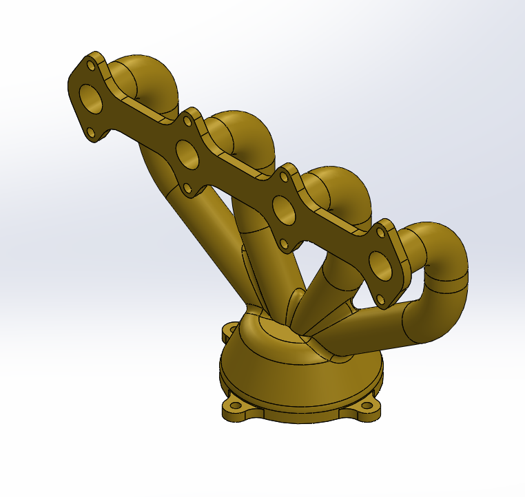

# 🚀 N1-Conception: Design Portfolio

*Welcome to N1-Conception – where engineering meets imagination!*  
Dive into a curated collection of mechanical marvels, meticulously modeled and brought to life using: 
> Auto-CAD | SolidWorks | SolidEdge

---

## 👨‍💻 About Me
# Hey there, I’m Nishchay Sharma 

>*Mechanical Engineer | Design Enthusiast | Problem Solver*

Welcome to my space on GitHub! I’m someone who enjoys bringing ideas to life through CAD, clean design, and solid engineering logic. I graduated with top honors in Mechanical Engineering. From intricate mechanisms to futuristic concepts, I blend precision with creativity to craft models that resonate who transforms ideas into tangible designs.

Here, you'll find a mix of creative CAD models, mechanical concepts, and side projects I’m genuinely proud of. Whether it’s an energy regen system or a fully modeled fighter jet, I like building things that make sense and look good doing it.

---

### Quick Demo – YouTube Short  

Just a glimpse of my design flow — short, sharp, and solid. More to come!

> "If you can imagine it, I can model it."  

---

## 🌟 Highlights

Here are a few of my standout designs—click to explore the folder and dive in:

- *Exhaust Manifold*
  
  The exhaust manifold is a crucial component in an internal combustion engine, responsible for collecting exhaust gases from multiple cylinders into a single pipe.

- *ScrewDriver* 
   
  The model focuses on achieving industrial-grade accuracy, ergonomic grip design .

- *Double Sided Wrench* 
   
  This is a double sided wrench made with fully constrained grometry, showcasing real world asthetics.

## 💡 Skills & Tools

- *CAD Modeling* – Parts, Assemblies, Exploded Views  
- *Design for Manufacturing* – Tolerances, Material Selection  
- *Creative Engineering* – Functional meets futuristic  
- *Software Proficiency* – SolidWorks, AutoCAD, CATIA V5

---

## 📂 How to Explore

1. Click any project folder above.
2. Each folder includes:
   - SolidWorks files (.SLDPRT, .SLDASM)
   - High-quality renders
   - Brief model notes (if applicable)

---

## 🤝 Let's Connect

Want to collaborate or share thoughts?

- [LinkedIn](https://www.linkedin.com/in/nishchay-sharma-b354a1221?utm_source=share&utm_campaign=share_via&utm_content=profile&utm_medium=android_app)  
- [Email](mailto:nishchaysharma1502@gmail.com)

---

> "Engineering is the art of directing the great sources of power in nature for the use and convenience of man." – Thomas Tredgold

---

Author

Nishchay Sharma

> B.Tech Mechanical Engineering | Lingaya’s Vidyapeeth (Gold Medalist)

>Design Engineer |

